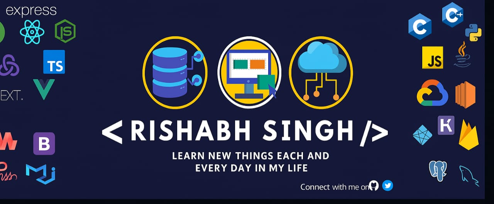

</a>

<h3 align="center">Hi folks! 👋, I'm Rishabh Singh. </h3>

<h4 align="center"> Full-Stack Developer | Gen AI | DSA Learner | C++ | AI & Robotics Enthusiast </h4>

## BIO

Full Stack Developer specialized in MERN Stack & Next.js, with strong experience in building scalable and responsive web applications.
Focused on crafting clean UIs, efficient backends, and seamless user experiences. Currently improving problem-solving with DSA and exploring **Gen AI** to combine software with intelligent systems.

 

  

<h2>🛠️ Skilled In</h2>

<h3>👨‍💻 Languages:</h3>
<table><tr>
  <td style="width:50px;height:50px;text-align:center;"></td>
  <td style="width:50px;height:50px;text-align:center;"></td>
  <td style="width:50px;height:50px;text-align:center;"></td>
  <td style="width:50px;height:50px;text-align:center;"></td>
  <td style="width:50px;height:50px;text-align:center;"></td>

</tr></table>

<h3>🌐 Web Development (Full-stack):</h3>

<h4>Frontend/UI:</h4>
<table><tr>
  <td style="width:50px;height:50px;text-align:center;"></td>
  <td style="width:50px;height:50px;text-align:center;"></td>
  <td style="width:50px;height:50px;text-align:center;"></td>
  <td style="width:50px;height:50px;text-align:center;"></td>
</tr></table>

<h4>Backend/Server:</h4>
<table><tr>
  <td style="width:50px;height:50px;text-align:center;"></td>
  <td style="width:50px;height:50px;text-align:center;"></td>
  <td style="width:50px;height:50px;text-align:center;"></td>
  <td style="width:50px;height:50px;text-align:center;"></td>
</tr></table>

<h4>Full-Stack Frameworks:</h4>
<table><tr>
  <td style="width:50px;height:50px;text-align:center;"></td>
</tr></table>

<h4>Database:</h4>
<table><tr>
  <td style="width:50px;height:50px;text-align:center;"></td>
  <td style="width:50px;height:50px;text-align:center;"></td>
</tr></table>

<h3>⚙️ DevOps:</h3>
<table><tr>
  <td style="width:50px;height:50px;text-align:center;"></td>
  <td style="width:50px;height:50px;text-align:center;"></td>
  <td style="width:50px;height:50px;text-align:center;"></td>
</tr></table>

 

## 🚀 Open Source Contributions </h2>

 

## Contribution Graph

 

## Overall Profile Stats

    

  

 

### CONNECT WITH ME ON

&nbsp;&nbsp;
&nbsp;&nbsp;
&nbsp;&nbsp;

